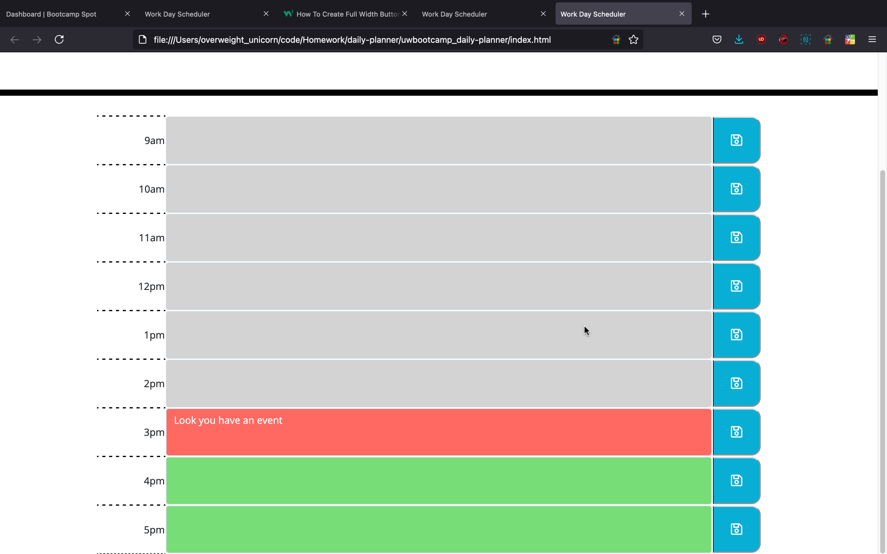
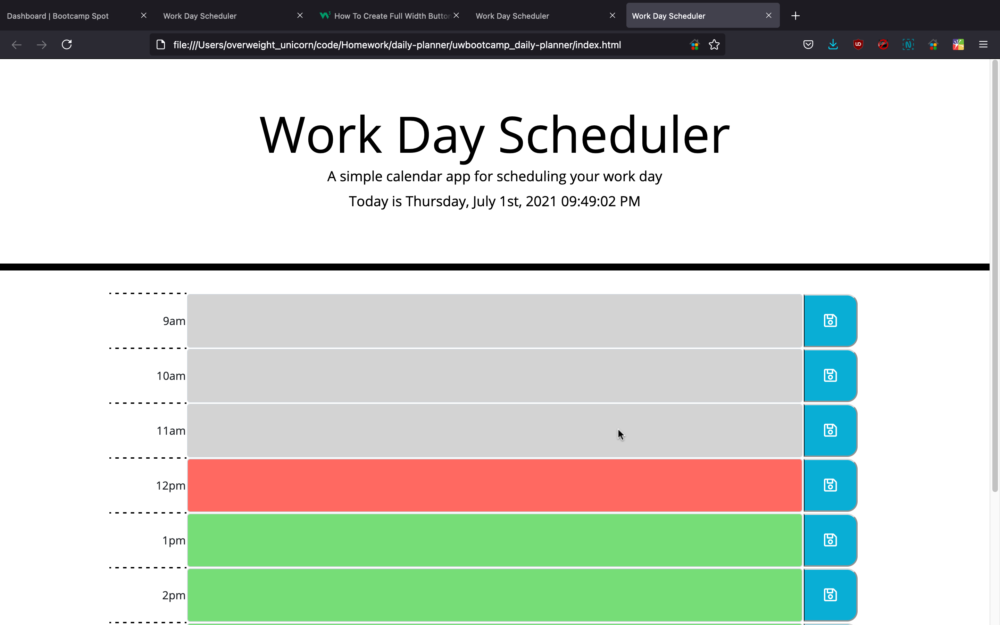

# Daily Planner
For this assignment we were tasked with building an interactive planner using jQuery, javascript, and CSS. The site needed to support the ability to add events to hour timeslots and save those timeslots on reload. 

# Reference
- [CSS Block Buttons](https://www.w3schools.com/howto/howto_css_block_buttons.asp)
- [jQuery on()](https://www.w3schools.com/jquery/event_on.asp)
- [icon-save: Font Awesome Icons](https://fontawesome.com/v3.2/icon/save)
- [jQuery Manipulating CSS](https://www.w3schools.com/jquery/jquery_css_classes.asp)

# What I Did
I used the moment.js library to handle control over the date and tracking the current hour. The planner is made using a table of elements and the javascript checks the elements and determines which style to use for it.

[Deployed Application](https://delizoderek.github.io/uwbootcamp_daily-planner/)

